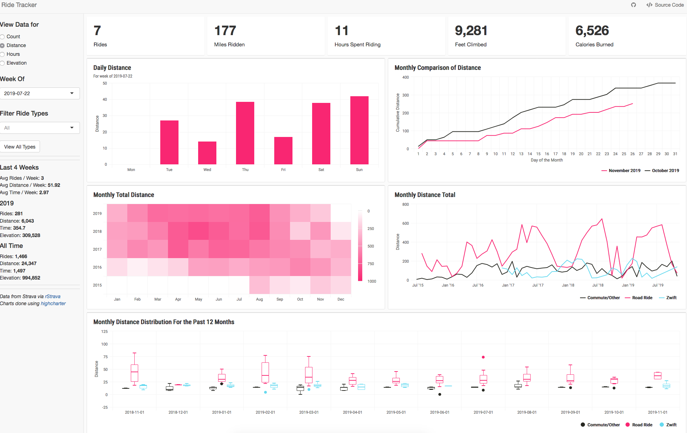

The [RideTracker](https://brndngrhm.shinyapps.io/RideTracker/) app was the first reactive data viz app I developed. It provides a way for me to track my training and commuting, in both a weekly snapshot view as well as over time, in ways that the [Strava](https://github.com/fawda123/rStrava) user profile page doesn't provide.

At the time, I'd been seeing so many cool examples of Shiny apps and really wanted to make my own. I decided to make one using my cycling data because I had just started to take training seriously and began racing competitively. I was looking for a way to analyze my training volume on a weekly basis and comparatively over time. The app is built on the `flexdashboard` framework with a `Shiny` reactive engine allowing me to dynamically filter the charts based on the sidebar inputs. I was able to retrieve my data using the [`rStrava` package](https://github.com/fawda123/rStrava), and created all the charts using the  `highcharter` package.

View the project on [GitHub](https://github.com/brndngrhm/rides).