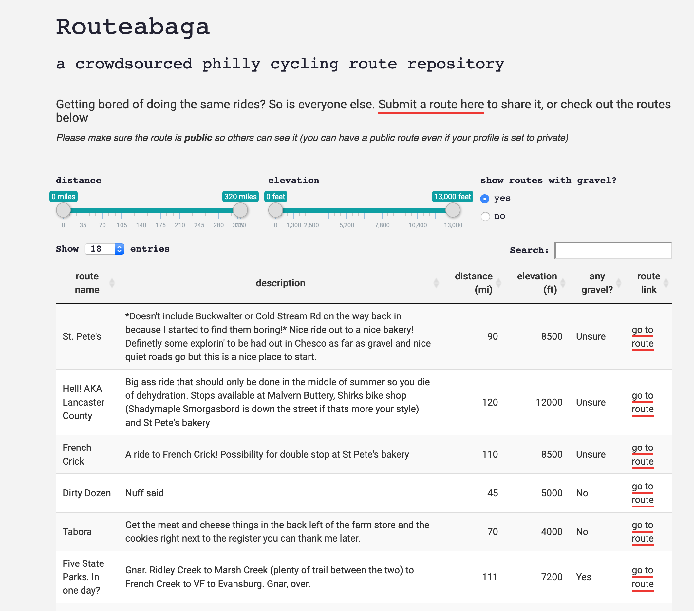

This is a simple website to help philly-area cyclists share and discover new routes. The site sources routes from a google sheet linked to a public [google form](https://docs.google.com/forms/d/e/1FAIpQLScAJz4tpKESbKfPZnADoPGhpm2Dy-M-45O6Pl1gf7x07rx4XA/viewform) that allows anyone to submit a route. The script then pplies some formatting, adds some filters and then presents the routes in the table you see above.

Visit the page [here](https://brndngrhm.shinyapps.io/Routeabaga/)
 