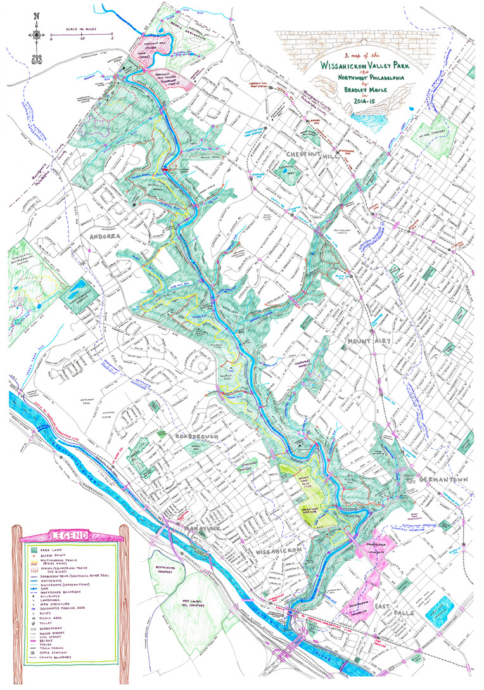
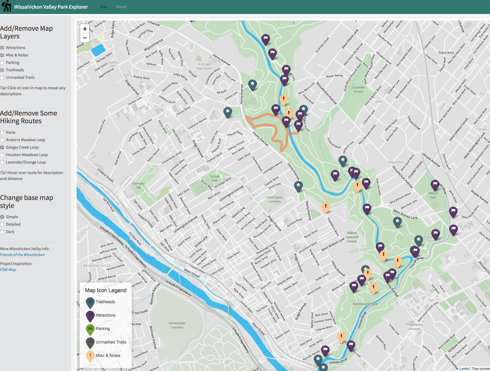

# Motivation

Shortly after moving to the Wissahickon neighborhood pf Philadelphia, I was looking for a detailed map of the Wissahickon Valley Park to plan some hikes and learn more about the woods. A lot of the maps I found through googling were either too detailed or not detailed enough, and almost none were interactive. One of the best maps I found was this one below - it has the right level of detail and big picture view I was looking for, but I never heard back from the creator about purchasing a print.

After some more goolging I found this [interactive map](https://www.google.com/maps/d/u/0/viewer?mid=13bnd0IRNwzTpI7VFPASNSWXC5yk) created by the Friends of the Wissahickon. It has a lot of the park attractions I was looking for in a map, but I really wanted to be able to make it my own and document my hiking loops, notes and tips. Rather than just make a copy of the Google map, I decided to create my own using `leaflet` and `R`.




source: [phillyskyline.com](http://phillyskyline.com/2015/04/22/happy-earth-day-and-other-assorted-one-mans-trash-affairs/) 

# Data Prep

To get started, I created a copy of the Friends of the Wissahickon map and exported each layer (Kiosks, Parking, Trailheads...) as its own `.KMZ` file, then used https://www.gpsvisualizer.com/convert_input to convert the `.KMZ` file to `.GPX`. A `.GPX` file is basically `XML` flavored with some GPS data, so once I had the all of the `.GPX` files, I was able to use the amazing `XML` R package to parse the `XML`.

As someone used to working with dataframes, parsing XML in R can be tricky. Once I understood the structure of the XML, I was able to create a function to parse the file:

```r
parse_hike_xml <-
  function(file){
    
    #import hike and parse
    hike_xml <-
      XML::xmlParse(file)
    nodes <-
      XML::getNodeSet(hike_xml, "//ns:trk", "ns")
    rows <-
      lapply(nodes, function(x) data.frame(xmlToList(x)))
    #usable dataframe
    plyr::ldply(rows, data.frame) %>% 
      reshape2::melt(id.vars = "name") %>%
      mutate(type = ifelse(value < 0, "lng", "lat")) %>%
      spread(type, value) %>%
      mutate(lng = as.numeric(lng),
             lat = as.numeric(lat),
             type = "Hike") %>%
      rename(desc = 2)
  }
```

Once I had the function I could read in each hike file, and use `purrr` to apply my function to each one. This automates *almost* all of the work - all I need to do is come up with a description for each new hike I add. These descriptions form the hover tool-tip when a user hovers over a route in the map.

```r
#stage hike gpx files
hike_files <-
  list.files('hikes/', pattern = "\\.gpx$")

master_hike <- 
  map(hike_files, ~parse_hike_xml(paste0("hikes/", .))) %>%
  map_df(., bind_rows) %>%
  mutate(name = as.character(name),
         desc = case_when(
           name == "Gorgas Creek Loop" ~ "Clockwise loop. Starts and ends at Mt Airy Trailhead. 1.49 Mi., 105 ft. elevation",
           name == "Houston Meadows Loop" ~ "Counter-clockwise loop. Starts and ends at Houston Playground. 2.48 Mi., 325 ft. elevation",
           name == "Andorra Meadow Loop" ~ "Clockwise loop. 1.52 Mi., 104 ft. elevation",
           name == "Lavender/Orange Loop" ~ "Clockwise loop. Park on Crefeld and go through gated park entrance. 1.89 Mi., 233 ft. elevation",
           TRUE ~ "other")
  )
```

I follow a similar process for adding in the markers for attractions, parking, trailheads...

The rest of the code is adding the map and layers using the awesome `leaflet` package. The map background changes depending user selection, and the user can also select to show certain hikes or not:

```r
# create base map and select map style based on user input
wiss_map <-
  if(input$map_style == "Simple"){
    
    leaflet(map_data) %>%
      addProviderTiles(providers$CartoDB.Positron) %>%
      setView(lng = -75.21111265778796,
              lat = 40.0493331396181,
              zoom = 14
      )
    
  } else if(input$map_style == "Detailed") {
    
    leaflet(map_data) %>%
      addProviderTiles(providers$HikeBike.HikeBike) %>%
      setView(lng = -75.21111265778796,
              lat = 40.0493331396181,
              zoom = 14
      )
  } else {
    
    leaflet(map_data) %>%
      addProviderTiles(providers$CartoDB.DarkMatter) %>%
      setView(lng = -75.21111265778796,
              lat = 40.0493331396181,
              zoom = 14
      )
  }

#map it
if(input$hike_select == "None") {
  
  wiss_map %>%  
    leaflet::addAwesomeMarkers(~lng,
                               ~lat,
                               popup = ~ as.character(desc),
                               label = ~ as.character(name),
                               labelOptions = labelOptions(textsize = '13px'),
                               icon = ~ my_icons) %>% 
    addControl(html = markerLegendHTML(IconSet = IconSet),
               position = "bottomleft")
  
} else {
  
  wiss_map %>% 
    leaflet::addAwesomeMarkers(~lng,
                               ~lat,
                               popup = ~ as.character(desc),
                               label = ~ as.character(name),
                               labelOptions = labelOptions(textsize = '13px'),
                               icon = ~ my_icons) %>%
    setView(lng = mean(hike_data$lng),
            lat = mean(hike_data$lat),
            zoom = 15
    ) %>%
    leaflet::addPolylines(hike_data$lng, 
                          hike_data$lat,
                          weight = 8, 
                          color = "#ff5719",
                          stroke = TRUE, 
                          fillOpacity = 500,
                          label = unique(hike_data$desc),
                          labelOptions = labelOptions(textsize = '15px')) %>%
    addControl(html = markerLegendHTML(IconSet = IconSet),
               position = "bottomleft")
}
```



You can check out all of the code for it on [GitHub](https://github.com/brndngrhm/wissahickon_valley_explorer), or view the app itself: https://explorethewiss.brendangraham.online

